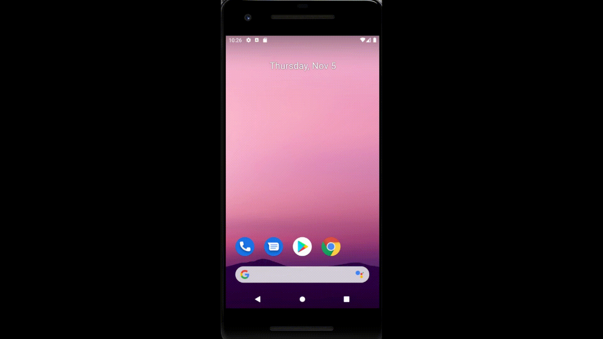

# 30 Days of Flutter

At the end of all 30 das was developed an age calculator that shows:
  - How old are you in years, months, weeks, days, hours and minutes;
  - How many months, days and which day of week will be your next birthday.

In commits are all days of the challenge that was given by [codewarriors](https://www.linkedin.com/company/codewarriors/).

For help getting started with Flutter, view our
[online documentation](https://flutter.dev/docs), which offers tutorials,
samples, guidance on mobile development, and a full API reference.
"# 30DaysOfFlutter" 
